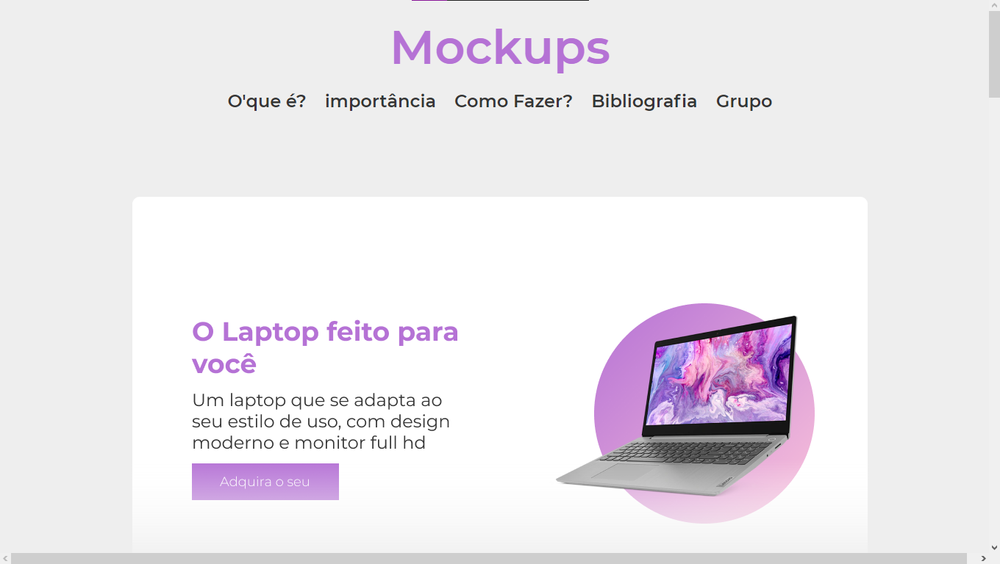

# Lima - Mockups

Projeto construido para a apresentação de um seminario durante as aulas de "lima", no <a href="https://jandira.sp.senai.br/">Senai - Jandira</a>, com o <a href="https://github.com/fernandoleonid">Prof° Leonid</a>, no curso de desenvolvimento de Sistemas.

## Qual era o objetivo do exercicio?

O objetivo do exercicio era realizar uma pesquisa sobre "mockups" e apresentar em formato de seminario.

## Tecnologias usadas

-   HTML 5
-   CSS 3
-   SASS
-   AOS library (Animate On Scroll)

## Grupo

-   <a href="https://github.com/adriellourenco" target="_blank">Adriel Lourenço</a>
-   <a href="https://github.com/Gabshh" target="_blank">Gabriel Gomes</a>
-   <a href="https://github.com/Leop4rdo" target="_blank">Leonardo Antunes</a>

## Link da pagina:

o site pode ser acessado pelo link:
<a href="https://leop4rdo.github.io/lima-mockups/">https://leop4rdo.github.io/lima-mockups/</a>
